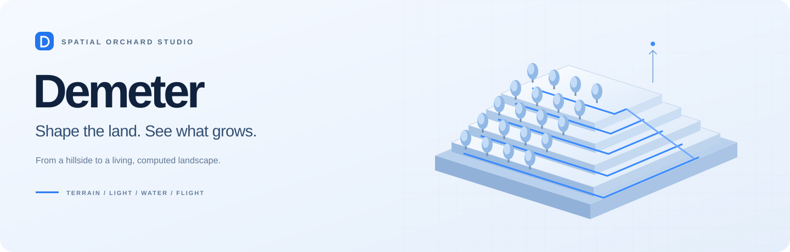
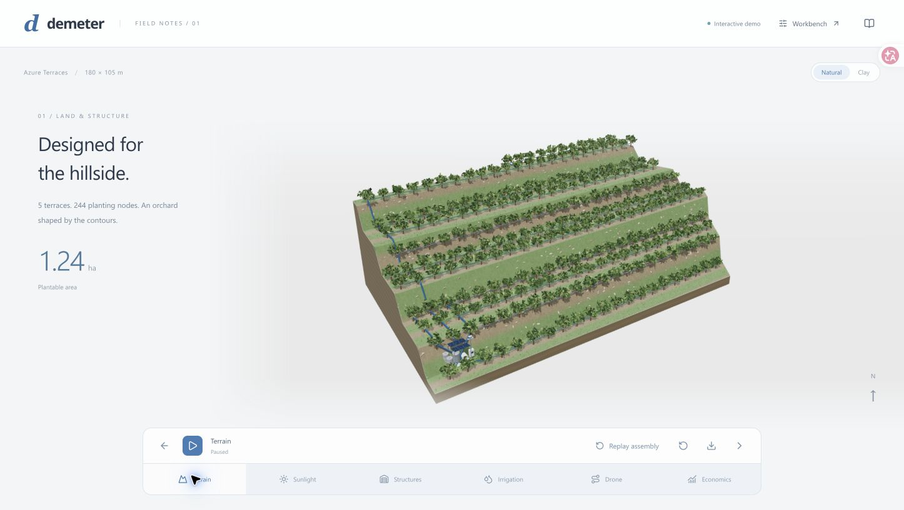
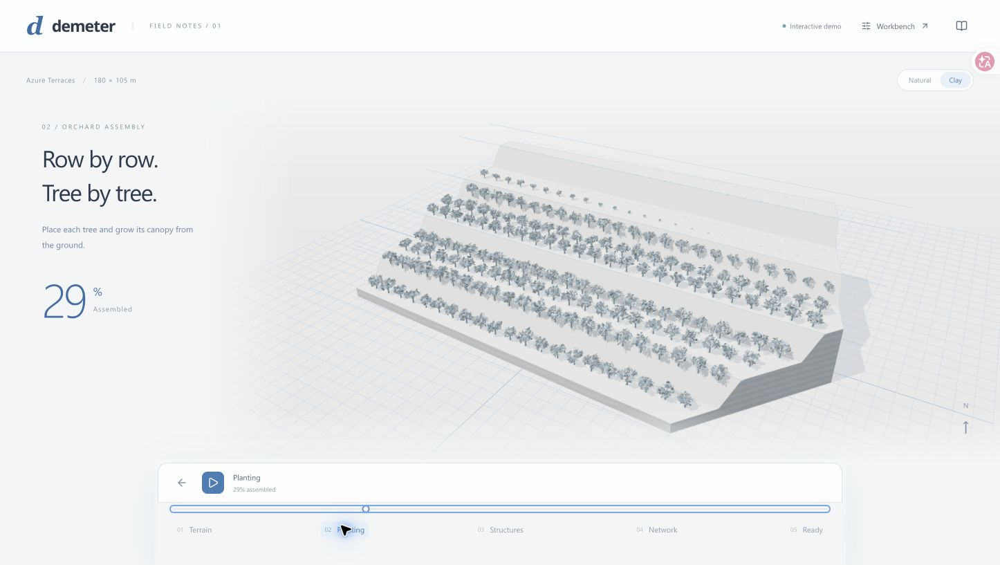
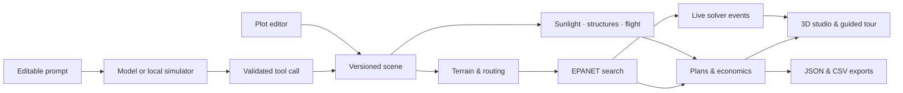

<div align="center">



**A cinematic 3D orchard studio, powered by geometry and engineering.**

Design the terrain. Follow the sunlight. Trace the water. Explore the return.

[](https://github.com/ddy314/demeter/actions/workflows/ci.yml)
[](LICENSE)
[](apps/web/src/Scene3D.tsx)
[](engine/hydraulics.py)

[Quick start](#quick-start) · [The experience](#the-experience) · [Under the surface](#under-the-surface) · [简体中文](README.zh-CN.md)

</div>



## An orchard, from the ground up

Demeter brings land, infrastructure and operations into one interactive scene. Choose a scenario prompt and watch a hillside take shape: terraces emerge, trees grow row by row, greenhouse frames assemble, and pipes extend through the orchard. A moving camera then walks you through the computed design.

Behind the scene, a Python engine evaluates hydraulic networks, terrain shade, greenhouse placement, drone coverage and five-year cash flow. Each result has a place in the landscape.

<table>
<tr>
<td align="center"><strong>244</strong><br/>orchard trees</td>
<td align="center"><strong>180 × 105 m</strong><br/>demo canvas</td>
<td align="center"><strong>108</strong><br/>network configurations</td>
<td align="center"><strong>6</strong><br/>guided chapters</td>
</tr>
</table>

**[Try the online demo](https://ddy314.github.io/demeter/)** · **[Download the container](https://github.com/ddy314/demeter/releases/latest)** · **[English startup guide](docs/QUICKSTART.md)**

## The experience

|                           | What you can explore                                                                                                         |
| :------------------------ | :--------------------------------------------------------------------------------------------------------------------------- |
| **Land & canopy**         | Editable boundaries, exclusions and terraced elevation. Procedural trees rooted to the same terrain used by the solver.      |
| **Light & shelter**       | A moving sun, terrain-obstructed direct sunlight and three greenhouse structures with adjustable transmission.               |
| **Water & pressure**      | EPANET hydraulic solves, pump and pipe selection, rotational watering, pressure overlays and cost–time tradeoffs.            |
| **Flight & coverage**     | Field-bounded sweep paths, obstacle-aware transfers, animated spray segments and calculated geometric coverage.              |
| **Costs & returns**       | Capital costs, annual cash flow, payback and five-year NPV. Adjust yield and price to explore the outcome.                   |
| **Construction & camera** | A 26-second assembly timeline, six guided camera chapters, pause, scrub, replay and natural or architectural clay materials. |

### Three ways into the landscape

**A Year on the Hillside** — A 32 m elevation change, summer sunlight, irrigation alternatives and annual operations.

**Room for Sunlight** — Three protective greenhouses, winter shade, roof transmission and five-year cash flow.

**Along the Mountain Wind** — A steeper winter orchard, 4 m drone swaths and a tour through coverage and operating costs.

The prompt is editable. A structured planner turns your request into validated scene and study parameters, then runs the actual engineering pipeline. NVIDIA Nemotron 3 Super on Nebius Token Factory interprets the brief through a validated tool contract; the engineering engines compute the results. An offline planner is available for local development.



### Go deeper in the workbench

Open **Workbench** to draw a plot, move the water source, add exclusions and tune terrain or budget. Generate a design, compare balanced, low-cost and fast alternatives, inspect individual trees and pipes, then export the project as JSON or its bill of materials as CSV.

Actual solver events drive the computation playback. You can revisit candidate configurations and pressure snapshots after the search completes.

## Quick start

**Requirements:** Node.js 22.12+, Python 3.12 and [uv](https://docs.astral.sh/uv/). Use a desktop browser with WebGL and hardware acceleration.

```sh
git clone https://github.com/ddy314/demeter.git
cd demeter
npm ci
uv sync --locked
npm run dev
```

Open **[localhost:5173](http://localhost:5173)**. The launcher starts the frontend and Python API together. The local simulator needs no API key. Choose **Try a custom plan** or enter:

```text
Plan a 160 x 90 m orchard; rise 12 m; budget 40k;
two greenhouses; winter; swath 4 m.
```

To use NVIDIA Nemotron 3 Super, copy `.env.example` to `.env`, set `DEMETER_MODEL_PROVIDER=nebius` and your `NEBIUS_API_KEY`, then reload the page. The model ID is already provided. See [container deployment and live verification](docs/DEPLOYMENT.md) or the [planner contract](docs/DESIGN.md).

For a production frontend served by the Python application, stop the development server, then run:

```sh
npm run build
npm start
```

Open **[localhost:8000](http://localhost:8000)**. Interactive API documentation is at [`/docs`](http://localhost:8000/docs).

## Under the surface



**Engineering.** Shapely constructs terrace-aligned terrain and planting geometry. NetworkX builds corridor routes. WNTR runs EPANET 2.2 across 108 combinations of route, pipe diameters, pump and zone count. Feasible candidates form a cost–time Pareto frontier; selected plans receive 12 seeded sensitivity checks.

**Rendering.** React Three Fiber and Three.js render instanced foliage, GPU-driven tree growth, staged structures and topology-ordered pipe reveals. Demand rendering, bounded canopy detail and reusable geometry keep the scene responsive as its scale grows.

**Studies.** Solar geometry and terrain ray tests estimate direct sunlight. Clipped sweep paths and visibility-graph transfers form drone routes. Shared study outputs feed the guided tour and editable financial model.

The equipment catalog and economic inputs are configurable scenario assumptions. Research references and model definitions live in the [research notes](docs/DEMO_RESEARCH.md) and [engineering literature](docs/LITERATURE.md).

## Project map

```text
apps/web/src/
  demo/            Prompt experience, construction sequence and camera tour
  scene/           Terrain, instanced trees, pipe network and GPU animation
engine/
  geometry.py      Terrain, planting, corridors and routing
  hydraulics.py    EPANET adapter, equipment catalog and material costs
  optimizer.py     Candidate search, Pareto plans and sensitivity analysis
  demo.py          Sunlight, greenhouse placement and drone studies
  design.py        Model adapters, structured patches and input validation
  api.py           FastAPI endpoints, solver events and exports
scripts/           Development launcher and reproducible demo checks
tests/             Physics, geometry, API and financial-model tests
docs/              Research, architecture and technical validation
```

## Development

```sh
npm run check                       # TypeScript + Ruff
npm test                            # Python + financial-model tests
npm run build                       # Production frontend
uv run python -m scripts.verify_demo    # Evaluate all three presets
uv run python -m scripts.verify_design  # Prompt → studies → EPANET → export
```

See the [planner guide](docs/DESIGN.md) for supported local prompts, model setup and the structured response format. The [research roadmap](docs/PLAN.md) covers calibrated equipment data, measured terrain import and richer planning tools.

## License

[MIT](LICENSE). Built with React, Three.js, FastAPI, Shapely, NetworkX and WNTR / EPANET.
