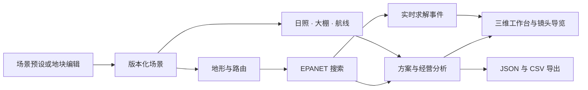

<div align="center">


**让几何与工程计算，成为可探索的三维果园。**

塑造地形，追踪日照，铺设管网，探索收益。

[](https://github.com/ddy314/demeter/actions/workflows/ci.yml)
[](LICENSE)
[](apps/web/src/Scene3D.tsx)
[](engine/hydraulics.py)

[快速开始](#快速开始) · [交互体验](#交互体验) · [计算与渲染](#计算与渲染) · [English](README.md)

</div>


## 从一片山地，到一座果园

Demeter 将地形、设施和作业规划放进同一个交互场景。选择一段场景提示词，看梯田逐层呈现、树木逐行生长、大棚骨架依次架起、管线沿供水路径延展，再跟随移动镜头探索计算结果。

场景背后的 Python 引擎计算水力管网、地形遮阴、大棚选址、无人机覆盖和五年现金流。每一项结果，都在三维空间中找到对应位置。

<table><tr>
<td align="center"><strong>244</strong><br/>棵果树</td>
<td align="center"><strong>180 × 105 m</strong><br/>演示画布</td>
<td align="center"><strong>108</strong><br/>种管网配置</td>
<td align="center"><strong>6</strong><br/>个导览章节</td>
</tr></table>

## 交互体验

| | 探索内容 |
| :--- | :--- |
| **地形与树冠** | 编辑边界、禁区和梯田高程。程序化树木扎根于求解器使用的同一地表。 |
| **日照与设施** | 移动太阳、地形遮挡下的直射光照，以及可调整透光率的三座大棚。 |
| **管网与压力** | EPANET 求解、泵与管径选择、分区轮灌、压力图层和成本—时间方案比较。 |
| **飞行与覆盖** | 田界内往返航线、绕障转场、喷洒动画与几何覆盖率。 |
| **投入与收益** | 初始投入、年度现金流、回收期、五年 NPV；调整产量和价格，观察结果。 |
| **建构与镜头** | 26 秒建构时间轴、六章镜头导览、暂停、拖动与重播，自然和建筑白模两套材质。 |

### 三种场景入口

**A Year on the Hillside** — 32 m 高差，夏季日照、灌溉方案与年度作业。

**Room for Sunlight** — 三座保护棚，冬季遮阴、棚膜透光与五年现金流。

**Along the Mountain Wind** — 更陡的冬季山地，4 m 无人机作业幅宽，覆盖与成本导览。

提示词入口在本地运行这些可复现预设；自由语言驱动设计属于后续模型集成方向。


### 进入工程工作台

打开 **Workbench**，绘制地块、移动水源、添加禁区并调整地形或预算。生成设计后，比较均衡、低成本与快速方案，选中树木或管段查看数据，将项目导出为 JSON，或将材料清单导出为 CSV。

计算回放由真实求解事件驱动；搜索结束后仍可查看候选配置和节点压力快照。

## 快速开始

需要 **Node.js 22.12+、Python 3.12 和 [uv](https://docs.astral.sh/uv/)**。建议使用支持 WebGL、开启硬件加速的桌面浏览器。

```sh
git clone https://github.com/ddy314/demeter.git
cd demeter
npm ci
uv sync --locked
npm run dev
```

打开 **[localhost:5173](http://localhost:5173)**。启动器同时运行前端与 Python API，本地演示无需 API key。

要由 Python 应用提供生产版前端，先停止开发服务，再运行：

```sh
npm run build
npm start
```

打开 **[localhost:8000](http://localhost:8000)**。交互式 API 文档位于 [`/docs`](http://localhost:8000/docs)。

## 计算与渲染



**工程计算。** Shapely 生成保留梯田折线的地形与种植几何，NetworkX 构造走廊路由。WNTR 调用 EPANET 2.2，评估路由、管径、水泵和分区的 108 种组合，从可行候选中提取成本—时间 Pareto 前沿，对代表方案进行 12 次固定种子敏感性检查。

**三维渲染。** React Three Fiber 与 Three.js 实现实例化树叶、GPU 树木生长、分部件架构和依管网拓扑延展的管线。按需渲染、受控树冠细节与几何复用支持更大场景。

**综合分析。** 太阳几何与地形射线检查估算直射光照，裁剪后的扫描线与可视图转场生成航线，共用的分析结果驱动导览与可编辑经营模型。

设备目录与经营参数采用可调整的场景假设。计算定义和论文依据见[综合研究](docs/DEMO_RESEARCH.md)与[工程文献](docs/LITERATURE.md)。

## 项目结构

```text
apps/web/src/
  demo/            提示词体验、建构序列、镜头导览
  scene/           地形、实例化树木、管网与 GPU 动画
engine/
  geometry.py      地形、种植节点、走廊与路由
  hydraulics.py    EPANET 适配、设备目录与材料成本
  optimizer.py     候选搜索、Pareto 方案与敏感性分析
  demo.py          日照、大棚选址与无人机分析
  api.py           FastAPI 接口、求解事件与导出
scripts/           开发启动器与可复现演示检查
tests/             物理、几何、API 与经营模型测试
docs/              研究、架构与技术验证
```

## 开发

```sh
npm run check                       # TypeScript + Ruff
npm test                            # Python + 经营模型测试
npm run build                       # 生产版前端
.venv/bin/python scripts/verify_demo.py  # 计算三个完整预设
```

[研究路线](docs/PLAN.md)涵盖后续设备标定、实测地形导入和结构化语言模型适配。[Nebius 工具调用脚本](docs/NEBIUS_SETUP.md)为模型集成提供独立起点。

## 许可

[MIT](LICENSE)。基于 React、Three.js、FastAPI、Shapely、NetworkX 和 WNTR / EPANET 构建。
