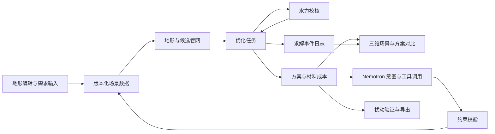

# Demeter 山地果园工程规划项目详细计划

版本：规划草案 v0.1。日期：2026 年 10 月 3 日，Asia/Shanghai。

依据：[文献依据清单](./LITERATURE.md)。当前已实现二维编辑、三维地形、EPANET 求解、108 组有限配置搜索、方案比较、敏感性检查、综合场景导览及导出。实现范围见 [README](../README.md)，计算记录见[技术验证](./VERIFICATION.md)。下文保留完整研究路线；未逐项勾选的高级任务属于规划范围。

Demeter 是可交互的山地果园规划工具：从地块与高程输入建立三维地形，在预算和设备约束下计算管网方案，并整合日照、大棚、无人机覆盖和经营分析。视觉核心是三维果园、分阶段建构和实际求解过程。

## 一 项目范围和第一版交付目标

**第一版主线：液压固定喷头管网的初步工程设计。** 输入地形、树行、供水、设备参数和预算，输出管网拓扑、管径、泵候选、分区运行计划、节点压力、成本明细和候选方案对比。

| 优先级 | 纳入内容 | 完成标准 |
|---|---|---|
| P0 必需 | 手绘地块、梯田和高程编辑；三维果园；可复核水力计算；基础管网方案；成本；Nemotron 修改约束；真实求解事件回放 | 一个端到端闭环能运行；输入变化确实改变计算；无可行解时明确返回原因 |
| P1 核心增强 | 多目标搜索、分区方案比较、不确定性分析、材料清单导出、三分钟演示 | 在同一输入、设备库和评价规则下比较方案，并保存计算依据 |
| P2 后续 | 人工喷枪接口方案、运输路线、实测地形导入、现场传感、设备控制 | 分别建立适用的物理模型和评价方法后再扩展 |

第一版不承担病虫害识别、遥感识别、模型训练、自动农药配方或施工控制。这样可以把时间集中到项目核心的地形编辑、工程计算与视觉呈现。

固定喷头与“铺管到接口、人工拿喷枪”是不同产品：前者主要比较设备成本、轮喷时间和水力指标；后者才适合计算人工步行和搬运距离。不得把两种作业方式的收益混为一谈。P0 不完成喷雾漂移或冠层沉积的 CFD 仿真；页面显示“服务覆盖”和“压力达标”，不显示未经验证的“防治有效率”。

## 二 对原讨论的关键修正

1. **二维边界不足以恢复唯一的三维地形。** 除长宽、形状外，必须提供坡向与高差，或梯田高程、控制点；缺失时使用明确标注的假设地形。
2. **泵扬程还要包含喷头末端所需压力。** 原讨论的“高差＋损失”不完整；每条供水路径都要满足末端工作要求。
3. **分区阀不会凭空增加能量。** 轮喷降低同时流量后可能减小摩擦损失；低区减压能限制过压；但静态高差造成的能量不足仍需泵、供水位置或工况调整。
4. **不同压力等级必须分开。** R01 的高压喷雾与 R04 的实验工况不能共用默认喷头和管材；设备组合需匹配。[文献说明](./LITERATURE.md)
5. **降低预算可能无解。** 不能保证用户每次压价都能得到覆盖和压力仍合格的方案；不得暗中放宽硬约束。
6. **“算了很多”来自真实事件。** 候选数、迭代数、淘汰原因、压力变化都从后端产生；已完成的计算可回放，但界面须区分实时求解与计算回放。
7. **仿真通过比例不是现实可靠性保证。** 显示扰动范围、样本数和条件性通过率；不把有限随机样本的最低压力称为全局最坏情况。

## 三 理论依据如何进入产品

下列为本项目的设计建议，论文实际支持范围和阅读状态见[文献表](./LITERATURE.md)。

| 理论或研究方向 | 对应文献 | 实现动作 | 用户能看到什么 |
|---|---|---|---|
| 固定式果园喷雾与地形适应 | R01–R05 | 建立系统类型、喷头和冠层配置数据；明确压力与沉积的区别 | 果树、喷头、管线、压力图层和设备说明 |
| 约束三角剖分 | R09 | 梯田边界保留为折线约束；在输入高程上构造分片地形 | 地块从二维草图逐步生成三维梯田 |
| 连通网络与管径联合优化 | R06 | 候选走廊图、连通拓扑编码、离散管径、成本计算 | 管线候选、被淘汰路线和费用变化 |
| 水力守恒与压力相关出流 | D01、D02 | 管损、泵曲线、末端出流和节点压力求解 | 哪一段损失大、哪个喷头压力不足 |
| 阀门调压与多目标搜索 | R07、R08 | 对泵、管径、轮喷分区做组合搜索 | 成本与作业时长折中、可行方案集 |
| 模型调用工具并观察结果 | R10、R11 | 自然语言生成约束补丁；服务器执行合法工具 | 一句话改预算，场景更新，并给出有数据依据的解释 |

不把这些工作的组合宣传为“首次”，也不以论文中的效率提升代替本项目实测。

## 四 整体系统框架



### 建议技术栈

| 层 | 建议选择 | 选择原因和边界 |
|---|---|---|
| 浏览器应用 | TypeScript、React、Vite；Three.js / React Three Fiber | 自定义三维场景；二维编辑和三维展示共享同一份场景数据 |
| 二维编辑 | SVG 或 Canvas 编辑层；撤销重做；多边形与折线工具 | 先实现有限、明确的操作，不建设通用 CAD |
| API 与校验 | Python、FastAPI、Pydantic | 几何、数值计算和优化方便集成；服务器校验所有单位和约束 |
| 几何与图 | Shapely、NumPy、NetworkX；三角剖分组件独立封装 | 选型阶段核验许可；前后端不各自维护互相矛盾的几何 |
| 水力引擎 | EPANET 2.2；可通过 WNTR 的 EpanetSimulator 接入 | 优先复用经过维护的求解器；首个技术验证确认 Darcy–Weisbach 与喷头出流适配 |
| 优化器 | 先启发式可行解，再评估 pymoo 的 NSGA-II | 同一校核器与目标函数服务全部算法；不从零实现整套遗传算法 |
| 任务与进度 | API 进程＋独立计算 worker；SSE 传事件 | CPU 求解不阻塞 API；任务可以取消、超时和恢复读取 |
| 存储 | 本地单机用 SQLite、JSON 和压缩事件文件 | 先保存场景版本、任务、方案及审计信息；多实例部署时再升级存储 |
| 模型 | 服务端调用 Nebius Token Factory 上可用的 NVIDIA Nemotron | API 密钥不进浏览器；型号在实际接入测试后锁定 |
| 部署 | 前端静态资源＋Python API/worker 容器 | 本地可运行，线上可复现；不因展示三维而引入 GPU 服务 |

以上是候选组件，不是已经验证的依赖组合。第一阶段锁定版本、许可和部署支持。水力、图搜索与当前规模的优化优先使用 CPU；模型使用托管 API，初版无训练任务。

### 建议目录结构

```text
demeter/
  apps/web/                     编辑器、三维场景、求解轨迹、方案比较
  services/api/                 场景与任务接口、权限、SSE
  services/worker/              任务运行、取消、预算与缓存
  packages/contracts/           场景、设备、方案与事件的版本化 schema
  engine/terrain/               梯田、网格、坡度与路径长度
  engine/network/               候选图、连通拓扑与服务节点
  engine/hydraulics/            单位转换、求解器适配、结果校核
  engine/optimization/          基线、联合搜索和约束修复
  engine/costing/               设备成本、安装成本与能耗
  engine/validation/            扰动、残差与工程约束检查
  agent/                       工具定义、模型适配和结果解释
  data/catalogs/               有来源的设备数据；模拟数据单独存放
  examples/                    固定种子场景、预存结果和回放
  tests/                       手算案例、回归与用户流程测试
  docs/                        计划、文献、模型说明与验证报告
```

该结构为后续搭建方案，本轮仅创建规划文档。

## 五 数据契约和输入流程

### 用户输入分为三步

1. **画地块。** 单位、边界、参考长宽；标出梯田、道路、水池和禁施工区域。
2. **描述高低。** 选择“规则坡面”或“分层梯田”；输入坡向及总高差，或逐层高程。局部控制点作为进阶项。
3. **描述作业与资源。** 株行距、树形或冠层尺寸；水源液位和供水限制；已有设备；预算；同时工作的喷头或轮喷方式。

最小表单先支持单地块、单水源、规则梯田、多条树行。水源只有位置而没有供水能力时，不自动推断泵压力。只有预算但没有设备目录时，可以使用标注清楚的演示目录计算，结果标为模拟成本。

### 需要优先确定的对象

| 对象 | 核心字段 | 约束 |
|---|---|---|
| TerrainSpec | `boundary_xy_m`、`terraces`、`control_points_xyz_m`、`elevation_uncertainty_m` | 局部坐标以米计；梯田高程不得互相矛盾；禁施工区可带缓冲距离 |
| OrchardSpec | 树行、株距、冠层、喷头模板、服务目标 | 自动摆树是用户输入的几何推导；不代表现场识别 |
| SourceSpec | 水位、流量上限、已有泵或候选泵、入口条件 | 有泵曲线时按工作点计算；恒定扬程仅用于明确的简化案例 |
| EquipmentCatalog | 管内径、粗糙度、额定压力、泵曲线、效率、喷头曲线、阀门损失、价格来源 | 同一型号有独立 ID；外径不可冒充内径；价格含日期与地区 |
| DesignConstraints | 预算、压力区间、覆盖目标、工时、电源、禁止区、锁定部件 | 分开保存硬约束和偏好；模型不能自行修改硬约束 |
| DesignPlan | 拓扑、管径、泵、分区、运行时段、水力结果、BOM、状态 | 关联场景版本、设备版本、算法参数和求解器版本 |
| RunEvent | `run_id`、`scene_revision`、`seq`、`type`、时间、候选 ID、结果摘要 | 事件可重放、去重和关联；过期任务结果不覆盖新场景 |

内部统一使用 SI：m、m³/s、Pa、s、W；界面可换算为 L/min、MPa、kWh。每个来源参数区分 `measured`、`catalog`、`user_estimated`、`synthetic`。

## 六 地形与候选网络算法

- [ ] **G01 边界检查。** 识别自交、多余顶点、零面积、孔洞、尺寸与面积冲突；错误应定位到编辑器。
- [ ] **G02 地形生成。** 规则坡面使用明确函数；梯田按分片平台与连接坡面生成。梯田边缘不能被普通平滑插值抹掉。
- [ ] **G03 几何一致性。** 保存统一的网格、坡度和查询函数；视觉高度夸张仅改变显示，不能改变计算高程。
- [ ] **G04 树行布置。** 依据株行距和梯田方向程序化生成；允许手动删改；避开道路和边界。
- [ ] **G05 允许施工走廊。** 道路、梯田边缘、行间及允许的跨层连接构成候选图；禁区直接删除候选边。
- [ ] **G06 地形长度。** 按地形上的折线路径累计三维长度，不能只算两端的平面直线距离。
- [ ] **G07 初始拓扑。** 以水源为根生成最短路径并集、树形基线及若干替代路径；最短图距离不是最终水力最优。
- [ ] **G08 连通性与接入。** 检查每个服务节点是否有允许路径；跨层路线中坡度、弯曲或安装限制由设备/工程约束决定。

首版限制为树形供水网络，降低连通性编码难度；回流与冲洗路线作为独立成本和工程项记录，未实现闭环冲洗仿真时明确标注。

## 七 水力与设备模型

下列是首版拟实现的单相稳态模型。参考 EPANET 的守恒模型与求解器能力；喷头的实际曲线仍需设备数据。[EPANET 官方资料](https://usepa.github.io/EPANET2.2/)

对于源到喷头的一条供水路径，采用压力水头、位置水头、泵增压和损失的平衡。忽略节点速度水头的简化条件下：

```math
\frac{p_i}{\rho g}=\frac{p_s}{\rho g}+z_s-z_i+H_{pump}(Q)-\sum_{e\in path(s,i)}(h_{f,e}+h_{m,e}).
```

沿程与局部损失：

```math
h_{f,e}=f_e\frac{L_e}{D_e}\frac{v_e^2}{2g},\qquad
h_{m,e}=K_e\frac{v_e^2}{2g},\qquad
v_e=\frac{4Q_e}{\pi D_e^2}.
```

实现时根据流态与粗糙度计算摩阻，求解流量和压力的耦合关系。喷头优先使用厂家压力流量表插值；只有适用时才用校准的 `q = k·p^x`，其中 `k` 必须绑定压力单位。不得把城市供水需求曲线直接当作所有喷头曲线。

**手算校验例：** 假设水的密度为 1000 kg/m³、g = 9.80665 m/s²，32 m 高差对应约 0.314 MPa 静压变化。如果某个假设喷头需要 0.30 MPa，则在入口表压为零、源点速度水头忽略时，仅克服高差并满足末端压力就需约 62.6 m 泵扬程，尚未计入管路损失。这是单位与符号检查例，不是推荐设备参数。

### 水力任务清单

- [ ] **H01 单管与分叉解析案例。** 校验单位、静压符号、质量守恒和能量残差。
- [ ] **H02 EPANET 适配验证。** 在小型网络确认 Darcy–Weisbach、喷头出流、泵曲线和分区阀的实际支持；显式记录引擎和版本。
- [ ] **H03 设备工况校验。** 计算运行工作点、节点最低/最高压力、流速和泵功率；检查停喷静压或关阀工况下的耐压限制。
- [ ] **H04 轮喷调度。** 不同分区分别求解；检查水源供给、储水量、总作业时长和最低工作压力。
- [ ] **H05 修复策略。** 分别试增大管径、变更泵、降低同时开启数量、低区减压；每次修复后重新求解完整网络。
- [ ] **H06 不可行诊断。** 返回高差不足、泵曲线不匹配、预算不足、管道过压、断连或不收敛等具体状态；不收敛不能算合格。
- [ ] **H07 模型边界。** 管材耐压、材料兼容、过滤及清洗列入目录与输出；瞬态水锤、气液两相和喷雾沉积仍是未验证能力。

压力可视化以节点和管段为主。全地表彩色层只可表达明确插值的节点指标，并附图例；不能让用户误以为整片土壤或冠层都有实测压力。

## 八 优化目标和算法顺序

### 决策变量

候选拓扑、每段离散管径、泵型号、分区归属、运行顺序，以及后续的阀门设定。喷头配置首版固定为一个已经核验的模板，避免把未知沉积规律一起交给优化器。

### 硬约束

所有目标节点可服务；所有轮喷工况压力合格；所有部件在允许范围内；水源流量和储量满足；不穿禁区；满足用户预算与工时硬上限。无解时保留硬约束，输出诊断及需要用户选择的放宽方向。

### 目标函数

首版 Pareto 图采用两个目标：**初装总成本**与**一次完整作业总时间**。后续可加入能耗；压力裕量和出流均匀性先作为约束与辅助指标。若一个场景里运行时间被完全固定，改用确实能变化的能耗目标，避免画没有意义的前沿。

本项目拟用的成本分解：

```math
C_{initial}=\sum_e L_e(c_{pipe,e}+c_{install,e})+C_{pump}+C_{valves}+C_{emitters}+C_{filter}+C_{tank}+C_{fittings}.
```

安装费随地形和施工方法的系数由本地报价或显式假设提供。每次作业能耗依据各工况的实际流量、泵扬程、效率和持续时间累计。作业时间包含各轮喷区、切换、充管及清洗估计；不同节点需要的液量不同则按各节点完成需求的最大时间确定分区时长，同时检查过量供给。

### 实现顺序

1. **O01 可复现基线。** 固定拓扑＋离散管径/泵枚举，形成第一份可行方案。搜索空间很小时用穷举保留真最优作为测试参照。
2. **O02 结构化邻域搜索。** 替换部分路径、调整管径、改变分区；以连通生成和合法变换减少无效解。
3. **O03 联合搜索。** 使用同一校核函数引入 NSGA-II，处理离散变量、约束违反量和可行性优先规则。
4. **O04 搜索缓存。** 缓存键含完整场景、设备、工况、算法和水力模型版本；改高程或喷头后不能复用旧压力值。
5. **O05 可中止优化。** 先返回首个可行解，再持续改进；超时返回已验证的最好候选并显示未完成状态。
6. **O06 公平算法比较。** 基线、随机搜索、NSGA-II 使用相同水力调用预算、输入、约束和设备；记录至少 5 个种子的可行率、目标值和耗时。

种群和代数在性能验证后确定。可从种群 32–64、10–30 代做试验，但这些是开发起点，不承诺固定秒数或固定方案数量。种群数乘代数并不等于“不同方案实际完成水力校核次数”；界面计数以去重和实际调用日志为准。

## 九 不确定性与证据分级

- [ ] **V01 高程扰动。** 按用户输入精度设置高程区间；同一梯田的误差可相关，不对所有节点随意独立扰动。
- [ ] **V02 工况扰动。** 对供水、粗糙度、喷头流量特性和局部损失设置有来源或标为假设的范围。
- [ ] **V03 比较公平性。** 候选方案共享同一组扰动样本；最终报告使用独立保留样本，降低选择带来的乐观偏差。
- [ ] **V04 结果表达。** 输出通过数/总数、样本最低压力、失效位置、扰动定义和随机种子；概率抽样时给相应置信区间。人为情景集合只报情景通过率。
- [ ] **V05 反例库。** 保存窄长果园、较大高差、山顶水源、供水不足、禁区切断、超低预算和缺参数场景。
- [ ] **V06 现场验证路线。** 先清水台架测压力与流量，再验证充管/停喷/清洗，最后才安排冠层沉积实验；软件仿真结果与实测结果分别显示。

第一次开发可用 30 个情景调试，最终演示可用 100–250 个情景，数量由运行预算决定。不得用固定的“98.4%”装饰界面。

## 十 Nemotron 的职责与工具契约

模型负责理解自然语言、提出必要的缺失字段、生成约束变更、调用工具和解释已验证结果。工程计算由服务器完成。模糊的“便宜点”只影响偏好，不自动转成一个用户没说过的预算；“上层要更强”不能超越设备允许压力。

| 工具 | 输入 | 输出及限制 |
|---|---|---|
| `validate_scene` | 场景版本 | 缺失字段和几何问题 |
| `propose_constraint_patch` | 用户文字、当前约束 | 类型化补丁、作用对象和解释；服务器再次验证 |
| `start_design_run` | 已校验版本、搜索预算 | 任务 ID；不让模型直接执行脚本 |
| `get_run_status` | 任务 ID | 真实阶段、计数与错误；轮询频率有限制 |
| `compare_plans` | 已存在且兼容的方案 ID | 成本、工时、压力和假设的差异 |
| `explain_violation` | 方案 ID、违规 ID | 由求解结果提供原因和已算出的替代项 |
| `export_plan` | 选中方案 ID | 版本化 JSON、BOM 和可读报告 |

**关键交互：** 用户说“预算改为 8000 元，顶部两层必须保留”。界面先显示解析后的预算和锁定区域，随后自动触发允许的重算；顶部对象不明确时只追问该对象。旧方案保留为历史版本。新的可行方案返回后展示差异；如果无解，显示当前预算下未找到可行方案，以及已验证的最低成本候选，不伪称已证明理论最低成本。

- [ ] **A01 平台连通。** 核对实际可用的 NVIDIA 模型 ID、权限、工具调用、JSON 能力、限流和计费。
- [ ] **A02 工具闭环。** 验证模型发出工具请求、收到结果并正确完成下一步；工具错误返回结构化信息。
- [ ] **A03 状态管理。** 设置模型调用轮数、重试、token 与时间预算；避免无限重算。
- [ ] **A04 解释校验。** 关键数值由 UI 或报告模板从方案对象填入；模型输出引用方案指标 ID，避免随意编造数值。
- [ ] **A05 评测集。** 至少 30 条中文/英文指令，覆盖预算、单位换算、保留对象、矛盾输入、缺失条件和无解。
- [ ] **A06 降级。** API 不可用时表单仍能启动本地工程求解；预存模型交互若回放，明确标注为回放。

## 十一 视觉与交互设计任务

主界面建议约 70% 为三维果园，右侧为可收起的工程面板，底部为可展开事件轨迹。以深色背景、低饱和地形、蓝色管网为基调。工程数字和图例要保持足够对比度，错误状态同时用图形和文字表达。

| 阶段 | 视觉表现 | 必须绑定的数据 |
|---|---|---|
| 编辑 | 网格、地块点、梯田边缘、高程手柄、尺寸标注 | 场景对象与单位 |
| 建模 | 三角网、等高线、地表抬升、树行依次出现 | 实际生成的网格与实例 |
| 候选生成 | 半透明管线沿允许走廊展开 | 真实候选图；大图按规则抽样显示 |
| 初步校核 | 管段颜色、压力数值、违规节点高亮 | 对应候选方案的水力结果 |
| 修复与优化 | 方案切换、成本曲线、Pareto 点更新 | 已完成评估的候选及淘汰原因 |
| 扰动验证 | 场景编号、通过/失败、失效位置 | 实际情景结果 |
| 方案选择 | 场景简化，突出选中网络与方案卡 | 已验证方案及设备成本明细 |
| 自然语言修改 | 约束差异卡、重算、前后对比 | 新的场景版本、任务与结果 |

- [ ] **U01 编辑体验。** 吸附、撤销重做、对象选择、删除、单位提示、自动保存。
- [ ] **U02 渲染结构。** 树木实例化、管线批处理、网格分辨率与设备性能档位。
- [ ] **U03 阶段动画。** 后端真实事件驱动状态；镜头轻微移动且可关闭；提供跳过回放和减弱动画选项。
- [ ] **U04 数据图层。** 压力、海拔、施工禁区、分区、管径独立开关；悬停可查看数值来源。
- [ ] **U05 Pareto 联动。** 点击点切换方案、成本和网络；灰色点的违规理由可见。
- [ ] **U06 异常设计。** 不可行、超时、网络断开和缺参数都有专用状态，不一直转圈。
- [ ] **U07 实时与回放。** 同一事件格式支持实时播放和保存回放；实际求解耗时与演示播放耗时分别记录。
- [ ] **U08 真实性。** 流动粒子仅用于示意时明确说明；没有瞬态模拟时不称为液体实际到达过程。

性能目标需在指定硬件与浏览器上验收：以 100–500 株树、50–300 个水力节点的演示规模为起点，争取常见交互达到 30 FPS 以上、直接编辑反馈约 100 ms 内。求解先测基线，再决定全局搜索预算；不能为了“看起来努力”人为阻塞结果。

## 十二 执行阶段 依赖与验收

以下排期假设从 10 月 3 日启动、约 20–24 个投入人日，范围是比赛级软件原型，不包含完成田间效果试验。团队规模与投入尚未确认，因此日期是倒排目标。第一阶段估时后应重排，不能把表格当作工期承诺。

| 阶段 | 建议日期 | 关键任务 | 依赖 | 可交付成果与验收 |
|---|---|---|---|---|
| M0 规格与技术验证 | 10/03–10/04 | 确定设备系统类型；冻结最小 schema；核验一组设备数据；EPANET 与模型 API 小试验 | 当前研究计划 | 一页规格、设备参数出处、单管结果、一次真实工具调用记录；参数缺口显式保留 |
| M1 最小闭环 | 10/05–10/08 | 一个梯田模板；简化二维输入与三维场景；树形基线；水力与成本；真实事件流 | M0 | 用户改高差后压力改变；保存场景可复现结果；形成首个可演示竖向切片 |
| M2 可编辑地形与可靠求解 | 10/09–10/12 | G01–G08；H01–H07；泵、管径、轮喷；不可行诊断 | M1 | 非矩形果园和禁区可用；手算及小网络校核通过；同一版本输入输出可追溯 |
| M3 优化与验证 | 10/13–10/16 | O01–O06；V01–V05；两目标对比；独立情景集 | M2 | 基线与优化器公平比较；至少 3 类几何场景及 5 个随机种子；报告实际改进和失败 |
| M4 Agent 与视觉整合 | 10/17–10/20 | A02–A06；U01–U08；自然语言重规划 | M2、M3；基础视觉在 M1 起持续完成 | 英文改预算闭环；关键数字可追溯；30 条模型指令评测；可切换真实回放 |
| M5 完整演示与部署 | 10/21–10/24 | 端到端、性能、取消恢复、导出；发布可访问测试版本 | M4 | 核心用户流程可靠；线上日志证明 Nebius/NVIDIA 真实调用；无密钥泄漏 |
| M6 提交材料与稳定性 | 10/25–10/28 | 中英说明、开源许可、部署指南、验证报告、视频与平台反馈 | M5 | 陌生用户能按说明运行；2 分 40 秒左右演示；对外数字均有来源 |
| 缓冲 | 10/29–10/30 | 修复阻断问题、再次核验规则、提交 | M6 | 截止前提交完成；不在最后一天增加新模块 |

**优先级规则：** M1 之前不追求复杂 Pareto 或宏大的 Agent 框架。M2 如果仍无法稳定得到可行方案，先保留基线优化和真实轨迹，把 NSGA-II 降为增强项。演示完整性、水力可信度和交互流畅性优先。

### 最初 48–72 小时应完成的事项

- [ ] P01 明确“液压固定喷头”主线，确定一个树形与喷头模板；缺少设备资料时只启用独立的模拟目录。
- [ ] P02 创建版本化 TerrainSpec、EquipmentCatalog、DesignConstraints 和 DesignPlan；先定义单位。
- [ ] P03 建立 120 m × 65 m、32 m 高差、5 层梯田合成示例，标为示意场景。
- [ ] P04 完成 32 m 静压差、单管损失、简单分叉的计算检查。
- [ ] P05 用 EPANET 运行一套最小管网，并画出节点压力。
- [ ] P06 让网页显示同一份数据生成的地形、树行、管网和两个真实指标。
- [ ] P07 定义事件 schema，保存并回放一次求解。
- [ ] P08 接通一个 Nemotron 模型，把“预算改成 8000”变成合法约束补丁，并触发一次真实求解。

如果这些项目完成，项目主链条已经成立，随后才值得大规模打磨视觉与搜索质量。

## 十三 验收标准与测试计划

所有数字均为拟定验收目标，尚未实测。

| 范畴 | 方法 | 拟定门槛或报告要求 |
|---|---|---|
| 几何 | 矩形、凹多边形、孔洞、分层高程、禁区案例 | 没有穿禁区或错误跨层的有效管线；控制点高程在约定容差内保留 |
| 水力 | 静压、单管、分叉手算；简单独立计算与 EPANET 对照 | 流量在非近零工况相对差异目标 ≤1%；压力水头差异目标 ≤0.1 m；近零量另设绝对容差 |
| 可行性 | 无解、缺参数、供水不足、过压和断连反例 | 硬约束违规方案不进入“推荐可行方案”；求解失败不隐藏 |
| 优化 | 小问题穷举；较大问题与基线同预算比较 | 报告近似质量、可行率和方差；若不能稳定优于基线，保留基线优先 |
| 场景完整性 | 预算、地形、喷头、设备目录分别修改 | 正确失效缓存；旧任务结果不会覆盖新版本 |
| 模型 | 30 条指令固定评测集 | 合法 schema 输出目标 ≥95%；通过服务端应用的变更中，越权放宽硬约束为零 |
| 解释 | 对照方案对象和工具日志 | 所有界面关键数值来自计算对象；没有来源的收益不显示 |
| 交互 | 编辑→建模→求解→比较→改预算→导出 | 核心流程在干净浏览器环境通过；撤销、取消、API 错误可恢复 |
| 性能 | 固定机器、浏览器、场景；多次运行 | 报告实际 FPS、交互延迟、求解时间分布、模型延迟与费用，不把目标值写成实测成绩 |
| 可复现 | 保存输入、目录、种子、版本、输出和事件 | 同配置结果在数值容差内一致；服务端有实际运行记录 |

不为装饰性动画堆叠测试；测试投入集中在单位、水力、约束、状态和核心用户流程。视觉检查保存主要阶段截图，包括失败状态与低性能档位。

## 十四 模型接入

- [ ] 服务端保存项目 API key，配置可用的 NVIDIA 模型 ID。
- [ ] 运行独立工具调用检查，验证名称、参数和结果回传。
- [ ] 将结构化约束补丁接入场景校验与求解任务。
- [ ] 建立固定指令集，记录正确率、token 用量与响应时延。
- [ ] 使解释中的数值可追溯到场景版本及实际求解结果。

配置与脚本见 [Nebius 模型集成](./NEBIUS_SETUP.md)。

## 十五 三分钟演示脚本

目标总长约 160 秒，剩余时间留给片头和转场。

| 时间 | 内容 | 必须已真实实现 |
|---|---|---|
| 0–15 秒 | 山地苹果园的地形与作业困难，说明目标用户 | 自有或有使用权限的素材；示意图注明性质 |
| 15–40 秒 | 画地块、设梯田高程、标水源，建立三维果园 | 同一结构化数据驱动二维与三维 |
| 40–75 秒 | 候选图出现，压力不足点被定位，尝试改管径/分区 | 真实求解事件；预选案例允许，但不编造违规 |
| 75–105 秒 | 对比低成本、较快作业、较大压力裕量候选 | 已算出的不同方案；没有足够候选就展示实际数量 |
| 105–140 秒 | 说“预算降低，顶部两层保留”，网络变化 | 真实模型工具调用与重新计算；必要时展示无解解释 |
| 140–160 秒 | 导出方案、材料和输入假设；展示适用边界 | 导出对应选中版本，且数值与界面一致 |

演示的技术亮点是“人类需求→可校验约束→真实求解→可解释设计”。三维特效服务于这条主线。

## 十六 实现路线

当前版本采用单 worker、JSON/JSONL 存储和有限配置枚举。后续优先补充真实设备数据与独立工况校核，再扩展模型工具调用、实测地形输入和部署能力。SQLite、多进程恢复、NSGA-II 及复杂约束仍属于研究路线。
